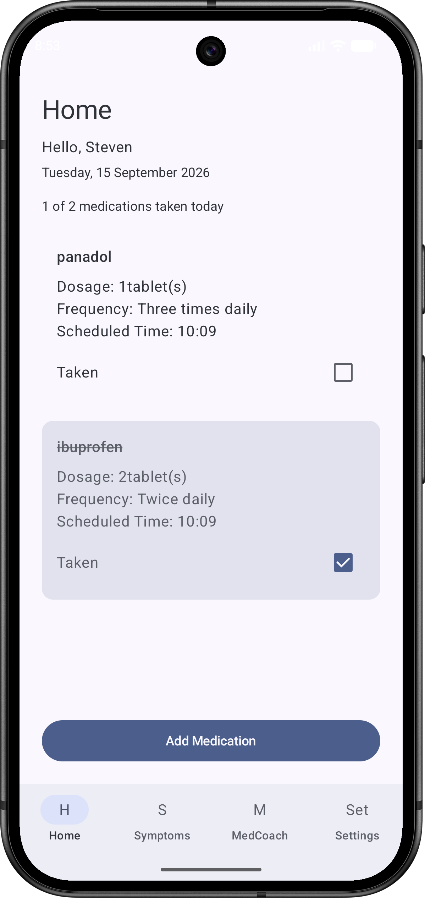
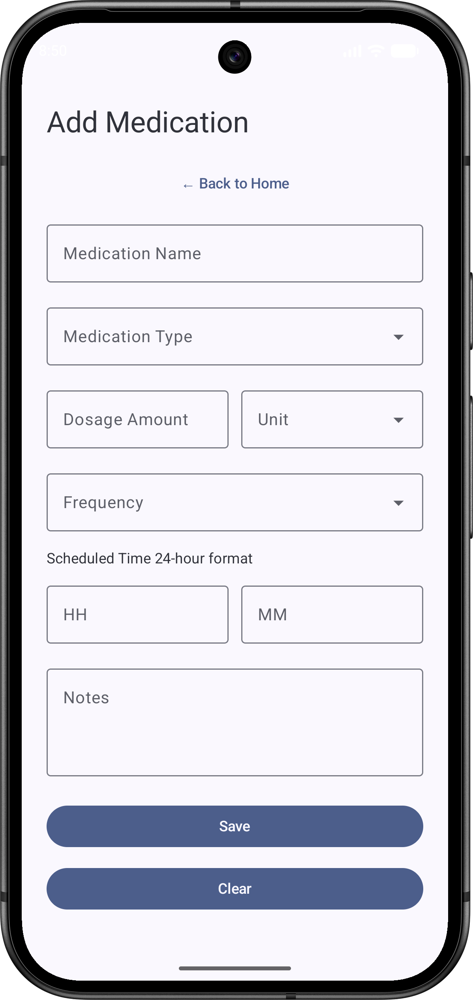
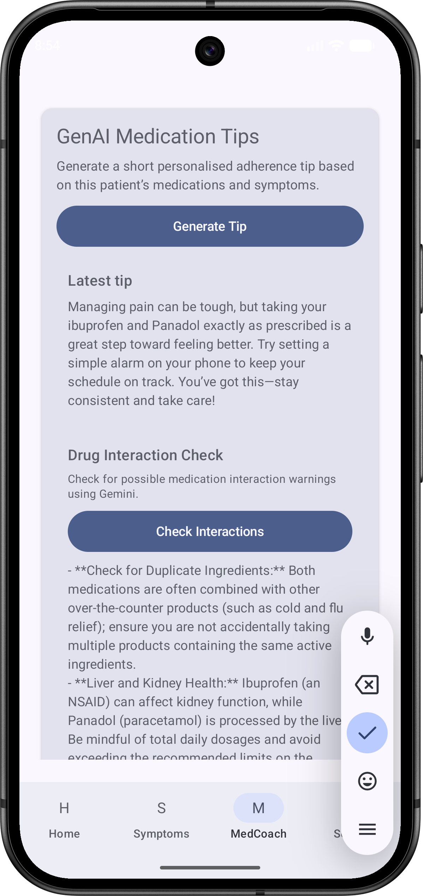
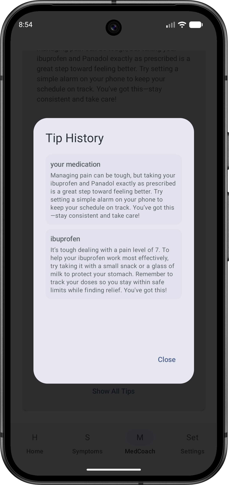
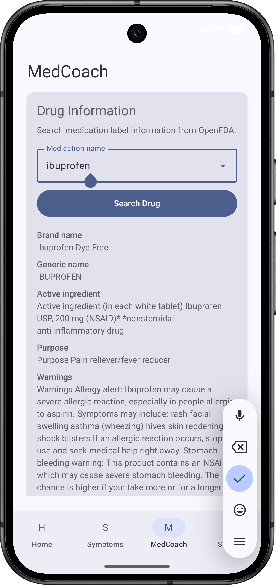
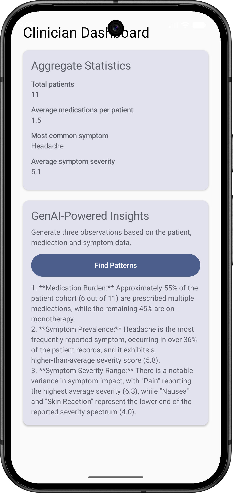

# MedTrack

MedTrack is an Android medication management application designed to help users manage medications, track symptoms, and access AI-assisted medication guidance.

The application combines medication and symptom tracking with external drug information from OpenFDA and AI-assisted features powered by Gemini, including personalised medication tips, potential drug interaction warnings, and clinician-facing insights.

## Tech Stack

- Kotlin
- Jetpack Compose
- Room
- MVVM Architecture
- Gemini API
- OpenFDA API

## Key Features

- **Medication Management** — Add and manage medications, including dosage, frequency, schedule and taken status.
- **Symptom Tracking** — Record symptoms with severity, notes, date and time.
- **AI Medication Coach** — Uses Gemini to generate personalised medication adherence tips based on medication and symptom data.
- **Drug Interaction Check** — Uses Gemini to identify potential medication interaction warnings.
- **Drug Information Search** — Integrates the OpenFDA API to retrieve medication label and safety information.
- **Clinician Dashboard** — Provides aggregate patient statistics and uses Gemini to generate AI-assisted observations from medication and symptom data.

## Screenshots

### Medication Management

  
  

### AI Medication Coach

  
  

### Drug Information

  

### Clinician Dashboard & AI Insights

  

## Architecture

MedTrack follows an MVVM-based architecture to separate the user interface, application logic and data layer.

- **UI Layer** — Built with Jetpack Compose for declarative Android interfaces.
- **ViewModel Layer** — Manages UI state and coordinates application logic.
- **Data Layer** — Uses Room for local persistence of medication, symptom and patient data.
- **External Services** — Connects to OpenFDA for drug information and Gemini for AI-assisted features.

## AI Integration

Gemini is integrated into several user-facing features rather than being used as a standalone chatbot.

The application provides relevant medication and symptom context to Gemini to support:

- personalised medication adherence tips;
- potential drug interaction warnings; and
- clinician-facing observations based on aggregated patient, medication and symptom data.

AI-generated information is presented as assistive information and is not intended to replace professional medical advice.

## External API Integration

MedTrack integrates the OpenFDA API to retrieve drug label information, including medication details and safety-related information.

This allows users to search for drug information directly within the MedCoach interface.

## Selected Implementation Samples

This repository includes selected, adapted implementation samples that demonstrate key technical aspects of MedTrack without publishing the complete original application source code.

- [`MedicationCoachSample.kt`](samples/ai/MedicationCoachSample.kt) — contextual prompt construction for Gemini-powered medication guidance.
- [`ClinicianInsightsSample.kt`](samples/ai/ClinicianInsightsSample.kt) — AI-assisted insights generated from aggregated medication and symptom data.
- [`OpenFdaApiSample.kt`](samples/api/OpenFdaApiSample.kt) — Retrofit-based OpenFDA integration with brand-name and generic-name fallback search.
- [`MedicationDataSample.kt`](samples/data/MedicationDataSample.kt) — Room entity, DAO and repository pattern for local medication persistence.

The samples are intentionally scoped for portfolio review and are not standalone copies of the complete application.

## Project Context

MedTrack was designed and developed by me as an Android application project during my Bachelor of Information Technology studies at Monash University.

This repository is a portfolio showcase of the project. Selected implementation samples are provided to demonstrate the architecture and technical approach without publishing the complete original academic submission.

## Disclaimer

MedTrack is an educational software project and is not a medical device. AI-generated content and drug information provided through the application should not be considered professional medical advice.